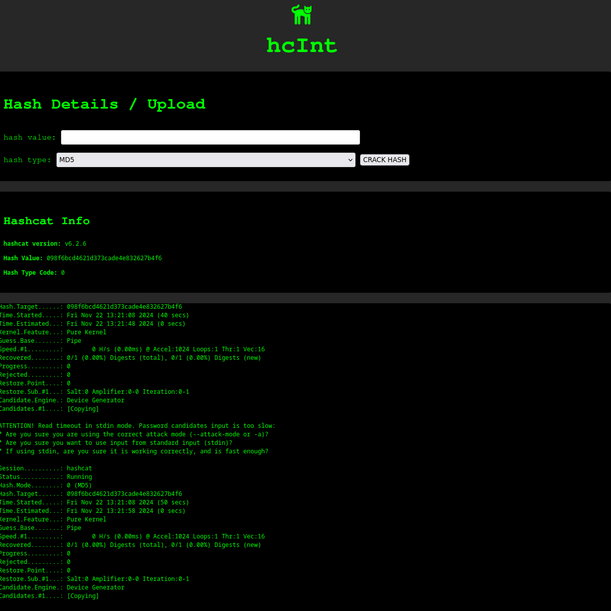

# hcInt - HashCat web INTerface


## Info

This project provides a web based frontend for hashcat. The idea is to allow you to use a more powerful computer to crack hashes while doing CTFs or similar. 

The idea came about when I was tired of copying/pasting a hash for a CTF into a VM I have with GPU passthrough over an SSH session. With this, you can open hcint in another tab, copy/paste directly into the hcint site and watch the command output.

hcInt can be hosted on a server with GPU passthrough or on your desktop PC.

#### Future enhancements:
- add a timer
- add a stop button to halt the hashcat process
- add additional (most used or all) hash types
- ~~implement wordlist selection~~
- ~~implement wordlist downloader~~
- change default runlevel to INFO and add DEBUG runlevel argument (-d)
- hashcat error checking

### Requirements
- hashcat installed on the computer running hcInt
- hashcat added to the users PATH who will be running hcInt
- python3
- python3-pip

### How to Use
Once the above requirements are in place, do the following:

1. Clone the project - `$ git clone https://github.com/l0g-lab/hcint`
2. Change Directory into hcint - `$ cd hcint`
3. Setup a python virtual environment - `$ python3 -m venv .venv`
4. Activate virtual environment - `$ source .venv/bin/activate`
5. Install python requirements - `$ pip install -r requirements.txt`
6. Run project - `$ python3 backend.py`
7. In your browser, navigate to: `http://127.0.0.1:5000`


## License

```
MIT License

© 2024 l0g

Permission is hereby granted, free of charge, to any person obtaining a copy of this software and associated documentation files (the "Software"), to deal in the Software without restriction, including without limitation the rights to use, copy, modify, merge, publish, distribute, sublicense, and/or sell copies of the Software, and to permit persons to whom the Software is furnished to do so, subject to the following conditions:

The above copyright notice and this permission notice shall be included in all copies or substantial portions of the Software.

THE SOFTWARE IS PROVIDED "AS IS", WITHOUT WARRANTY OF ANY KIND, EXPRESS OR IMPLIED, INCLUDING BUT NOT LIMITED TO THE WARRANTIES OF MERCHANTABILITY,
FITNESS FOR A PARTICULAR PURPOSE AND NONINFRINGEMENT. IN NO EVENT SHALL THE
AUTHORS OR COPYRIGHT HOLDERS BE LIABLE FOR ANY CLAIM, DAMAGES OR OTHER
LIABILITY, WHETHER IN AN ACTION OF CONTRACT, TORT OR OTHERWISE, ARISING FROM,
OUT OF OR IN CONNECTION WITH THE SOFTWARE OR THE USE OR OTHER DEALINGS IN THE
SOFTWARE.
```
